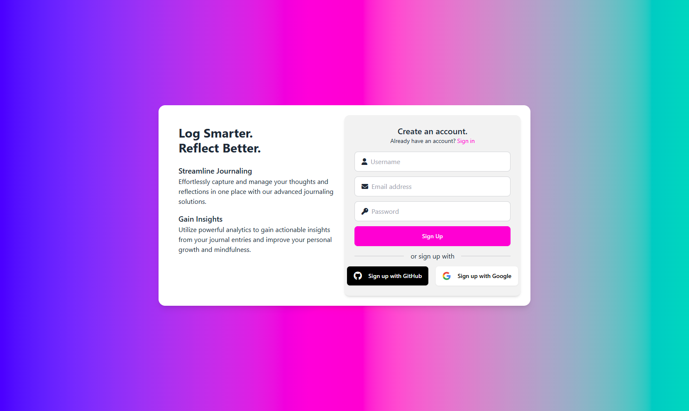
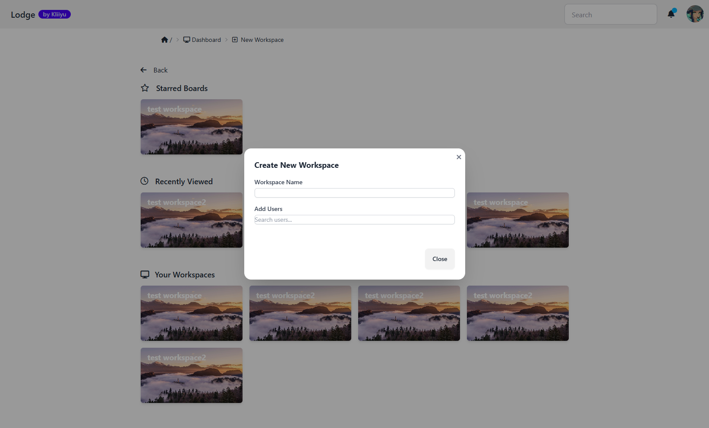
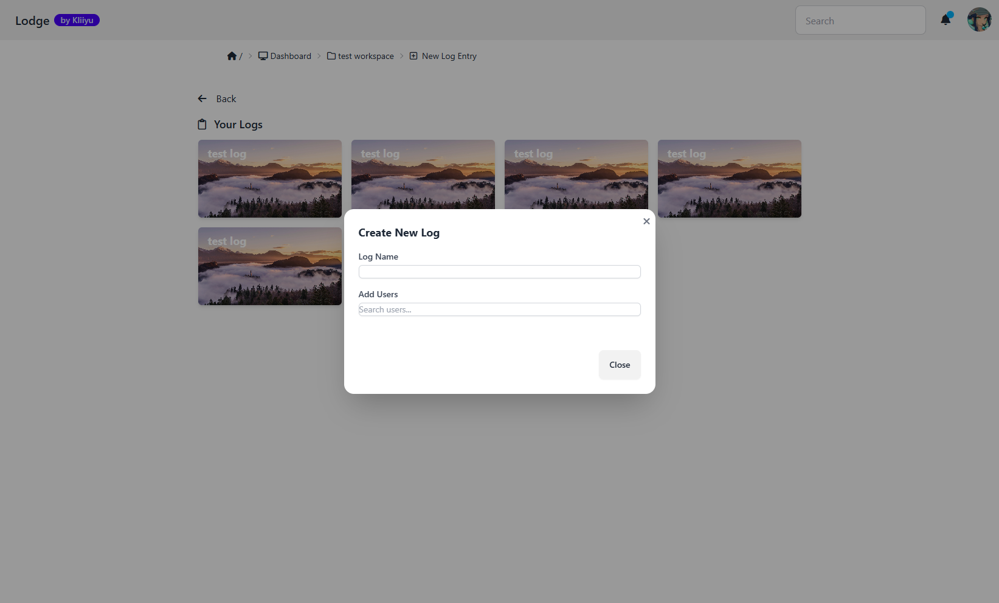
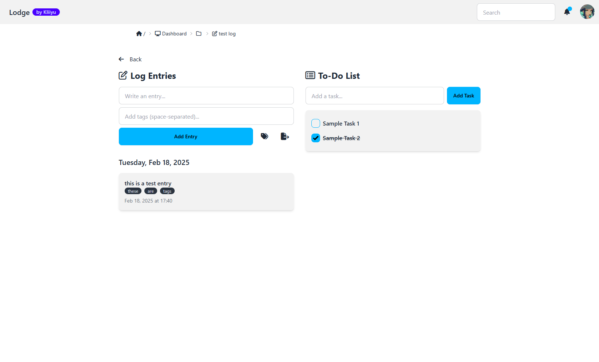

# How to use Lodge

### Go to the Lodge website at [REDACTED]

First things first you will need an account, if you already have one go ahead and login, otherwise click on "sign up"

You can register with either a username and email, or using Github or Google.

[picture]()

Once youve logged in you can click on dashboard, and get started by making a new workspace!
` `To make a new workspace simply click on the "new workspace" button in the top row in the middle of the screen.
` `Name it, and add whomever you please!

Here you can also **star** certain workspaces to make them more easily accessible.

From here you can create a new log

in each log there are 2 sections, the **journal** and a **todo-list**
` `When writing a log entry in the journal, you can create and use tags, this way you can easily find something by sorting by tag.
` `You can add things to do in the todo-list, and cross them off when theyre done!

**Use the icons next to the "Add entry" button to sort by tags, or to export the log as PDF or CSV.**

